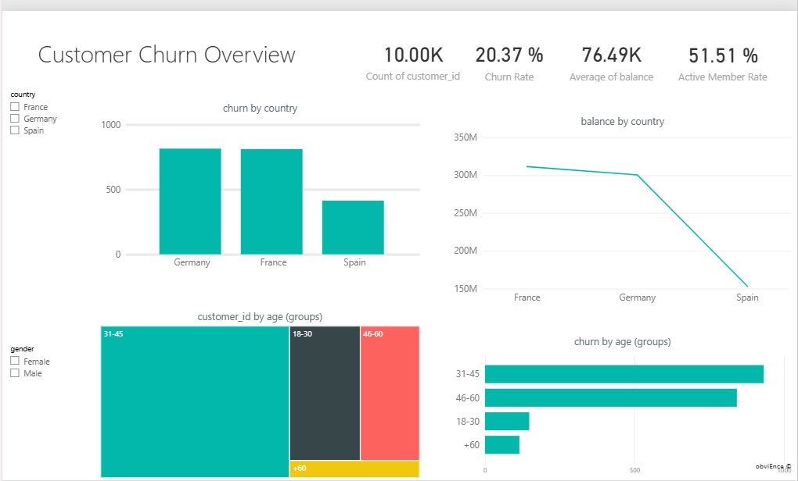
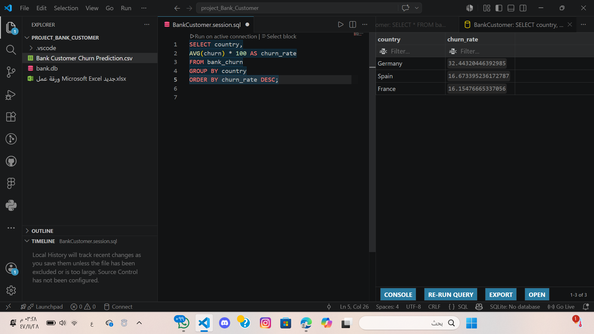
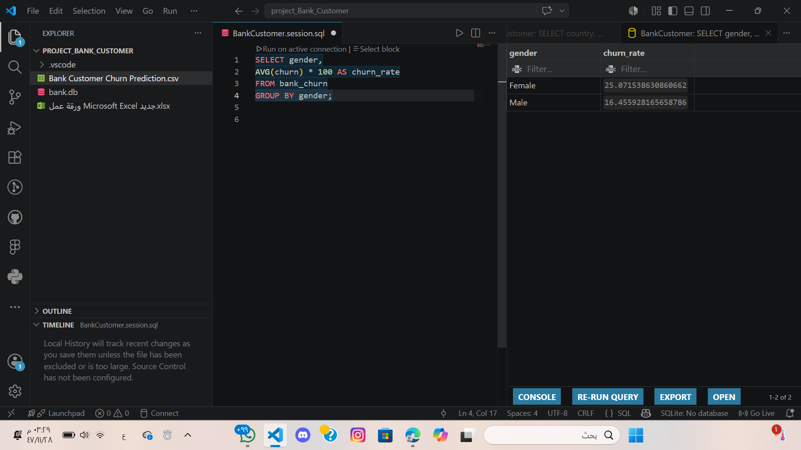
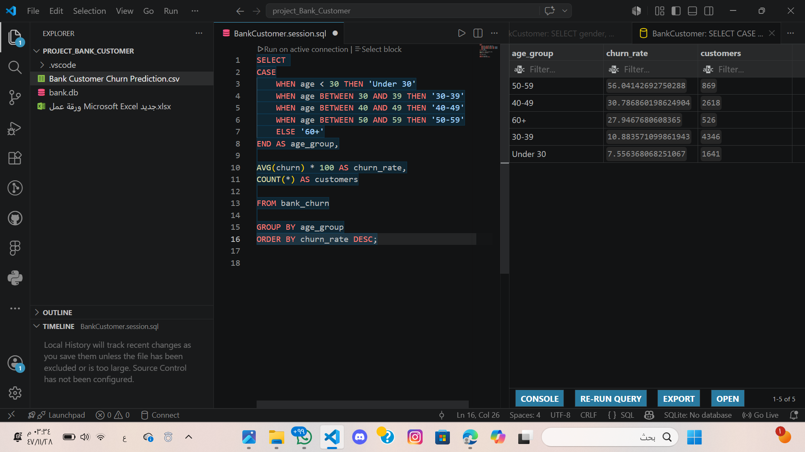

# Customer Churn Analysis

## Overview
This project analyzes customer churn behavior using SQL and Power BI to identify high-risk customer groups and support retention decisions.

---

## Tools Used
- SQL
- SQLite
- Power BI
- VS Code

---

## Key Insights
- Germany has the highest churn rate
- Female customers churn more than males
- Customers aged 50–59 have the highest churn rate
- Churned customers tend to have higher account balances

---

## Dashboard Preview



---

## SQL Analysis Examples

### Churn Rate by Country

```sql
SELECT country,
AVG(churn) * 100 AS churn_rate
FROM bank_churn
GROUP BY country
ORDER BY churn_rate DESC;
```

Result:
- Germany has the highest churn rate.



---

### Churn Rate by Gender

```sql
SELECT gender,
AVG(churn) * 100 AS churn_rate
FROM bank_churn
GROUP BY gender;
```

Result:
- Female customers churn more than males.



---

### Churn Rate by Age Group

```sql
SELECT
CASE
WHEN age < 30 THEN 'Under 30'
WHEN age BETWEEN 30 AND 39 THEN '30-39'
WHEN age BETWEEN 40 AND 49 THEN '40-49'
WHEN age BETWEEN 50 AND 59 THEN '50-59'
ELSE '60+'
END AS age_group,

AVG(churn) * 100 AS churn_rate

FROM bank_churn

GROUP BY age_group
ORDER BY churn_rate DESC;
```

Result:
- Customers aged 50–59 represent the highest-risk segment.


